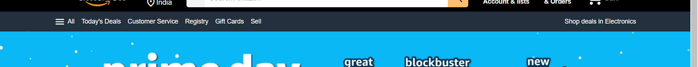
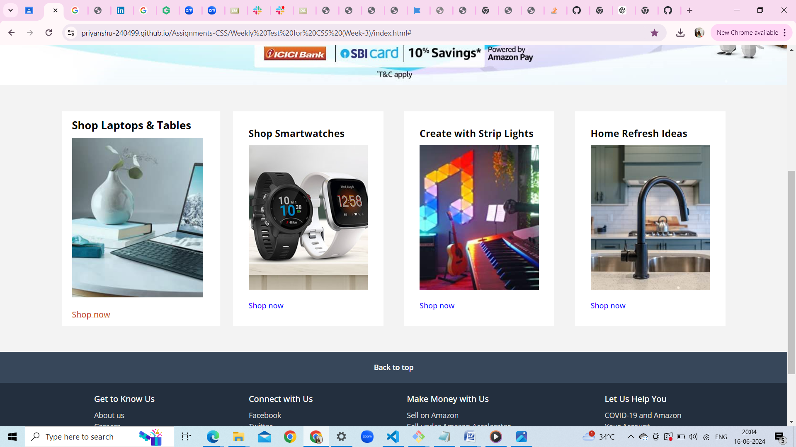

# Weekly Test 5

## HTML tags used are
Header,nav,div,a,p,select,option,span and input
# CSS properties are
background-color,width,height,max-width,cursor,display(flex),justify-content,align-items,margin,text-decoration

## HTML tags used are
div,a,span,ul and li
# CSS properties are
background-color,width,height,max-width,cursor,display(flex),justify-content,align-items,margin,text-decoration,gap,flex-grow

## HTML tags used are
section
# CSS properties are
background-image,height,background-position,background-size

## HTML tags used are
section,div,h3,img,a,a:hover
# CSS properties are
display(grid),grid-template-columns,display(flex),justify-content,align-items,gap,width,height,margin,padding,max-width,transition,white-space,transform,flex-direction

## HTML tags used are
footer,div,h3,ul,a,li
# CSS properties are
display(flex),justify-content,align-items,gap,width,height,margin,padding,max-width,flex-direction

